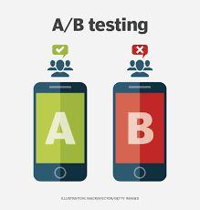

# Comparison of AB Test and Conversion of Bidding Methods

## Business Problem

Facebook recently introduced a new bidding type, "average bidding," as an alternative to the existing "maximumbidding" bidding type.

One of our customers, bombabomba.com, decided to test this new feature and wants to do an A/B test to see if average bidding brings more conversions than maximumbidding.

A/B testing has been going on for 1 month and bombabomba.com now expects you to analyze the results of this A/B test. The ultimate measure of success for Bombabomba.com is Purchase. Therefore, the focus should be on the Purchase metric for statistical testing.

## Dataset

This data set, which includes a company's website information, includes information such as the number of advertisements that users see and click on, as well as income obtained from it. There are two separate data sets: Control and Test group. These data sets are located on separate sheets of the ab_testing.xlsx. Maximum Bidding was applied to the control group and Average Bidding was applied to the test group.

| Column     | Description                                    |
|------------|------------------------------------------------|
| Impression | Number of ad views                             |
| Click      | Number of clicks on the ad displayed           |
| Purchase   | Number of products purchased after ads clicked | 
| Earning    | Income after purchased products                | 

