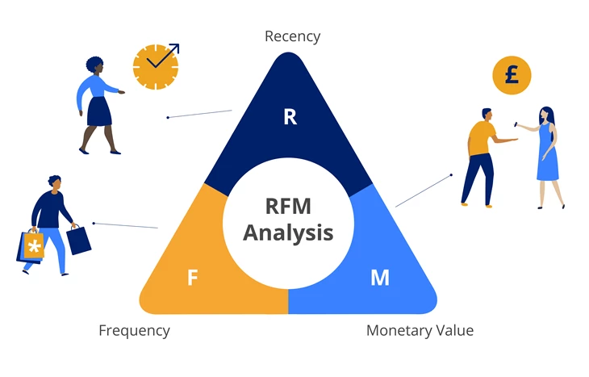

# Customer Segmentation with RFM Analysis

## Business Problem
FLO, an online shoe store, wants to divide its customers into segments and determine marketing strategies according to these segments. To this end, customers' behaviors will be defined and groups will be created based on clusters in these behaviors.

    

## Dataset

The data set consists of information obtained from the past shopping behavior of customers who made their last purchases from Flo via OmniChannel (both online and offline shopping) in 2020 - 2021.

| Column                            | Description                                                                     |
|-----------------------------------|---------------------------------------------------------------------------------|
| master_id                         | Unique customer id                                                              |
| order_channel                     | Which channel of the shopping platform is used  (Android, iOS, Desktop, Mobile) |
| last_order_channel                | Channel where last purchase was made                                            |
| first_order_date                  | Date of the customer's first purchase                                           |
| last_order_date                   | Customer's last purchase date                                                   |
| last_order_date_online            | The customer's last shopping date  on the online platform                       |
| last_order_date_offline           | The last shopping date of the customer  on the offline platform                 |
| order_num_total_ever_online       | Total number of purchases made by  the customer on the online platform          |
| order_num_total_ever_offline      | Total number of purchases made by  the customer offline                         |
| customer_value_total_ever_offline | Total fee paid by the customer for offline purchases                            |
| customer_value_total_ever_online  | Total fee paid by the customer for online shopping                              |
| interested_in_categories_12       | List of categories the customer has shopped  in the last 12 months              |

