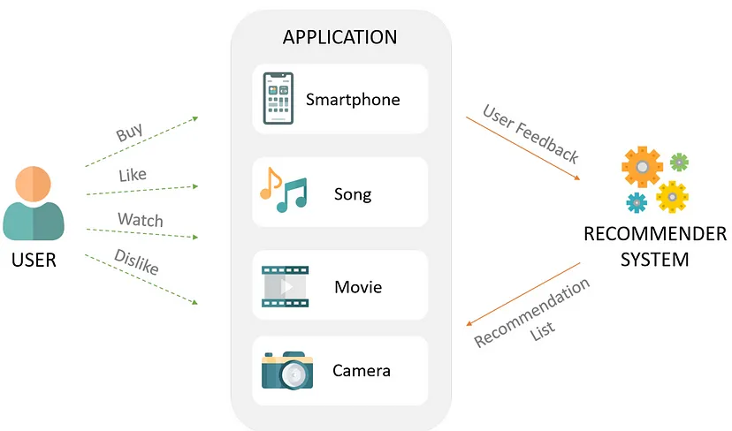

# Association Rule Based Recommender System

## Business Problem

Armut, Turkey's largest online service platform, brings together service providers and those who want to receive service. It allows you to easily access services such as cleaning, renovation and transportation with a few taps on your computer or smartphone. It is desired to create a product recommendation system with Association Rule Learning, using the data set containing service users and the services and categories received by these users.

## Dataset

The data set consists of the services received by customers and the categories of these services. It contains date and time information of each service received.

| Column     | Description                                             |
|------------|---------------------------------------------------------|
| UserId     | Customer id                                             |
| ServiceId  | They are anonymized services belonging to each category |
| CategoryId | They are anonymized categories                          |
| CreateDate | Date the service was purchased                          |

* ServiceId: They are anonymized services belonging to each category. (Example: Sofa washing service under the cleaning category) A ServiceId can be found under different categories and represents different services under different categories. (Example: The service with CategoryId 7 and ServiceId 4 is radiator cleaning, while the service with CategoryId 2 and ServiceId 4 is furniture assembly)

* CategoryId: They are anonymized categories. (Example: Cleaning, transportation, renovation category)

