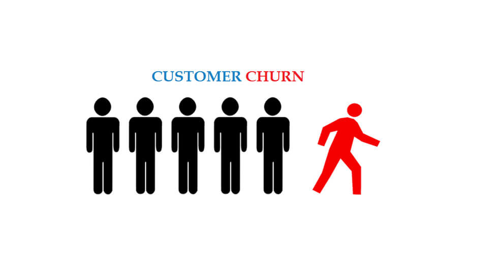

# Telco Churn Prediction

## Business Problem

It is expected to develop a machine learning model that can predict customers who will leave the company.

    

## Dataset

Telco customer churn data includes information about a fictitious telecom company that provided home phone and Internet services to 7,043 customers in California in the third quarter. It shows which customers left, stayed, or signed up for their service.

| Column            | Description                                                                                                    |
|-------------------|----------------------------------------------------------------------------------------------------------------|
| CustomerId        | Unique Customer Id                                                                                             |
| Gender            | Gender                                                                                                         |
| SeniorCitizen     | Whether the customer is old (1, 0)                                                                             |
| Partner           | Whether the customer has a partner (Yes, No)                                                                   |
| Dependents        | Whether the client has dependents (Yes, No)                                                                    |
| tenure            | Number of months the customer stayed with the company                                                          |
| PhoneService      | Whether the customer has phone service (Yes, No)                                                               |
| MultipleLines     | Whether the customer has more than one line (Yes, No, No phone service)                                        |
| InternetService   | Customer's internet service provider (DSL, Fiber optic, No)                                                    |
| OnlineSecurity    | Whether the customer has online security (Yes, No, No internet service)                                        |
| OnlineBackup      | Whether the customer has an online backup (Yes, No, no Internet service)                                       |
| DeviceProtection  | Whether the customer has device protection (Yes, No, No Internet service)                                      |
| TechSupport       | Whether the customer has technical support (Yes, No, No Internet service)                                      |
| StreamingTV       | Whether the customer has TV broadcast (Yes, No, No Internet service)                                           |
| StreamingMovies   | Whether the customer is streaming movies (Yes, No, No internet service)                                        |
| Contract          | Customer's contract period (Month to month, One year, Two years)                                               |
| PaperlessBilling  | Whether the customer has a paperless invoice (Yes, No)                                                         |
| PaymentMethod     | Customer's payment method (Electronic check, Postal check, Bank transfer (automatic), Credit card (automatic)) |
| MonthlyCharges    | Monthly amount charges                                                                                         |
| TotalCharges      | Total amount charges                                                                                           |
| Churn             | Whether the customer uses it (Yes or No)                                                                       |

