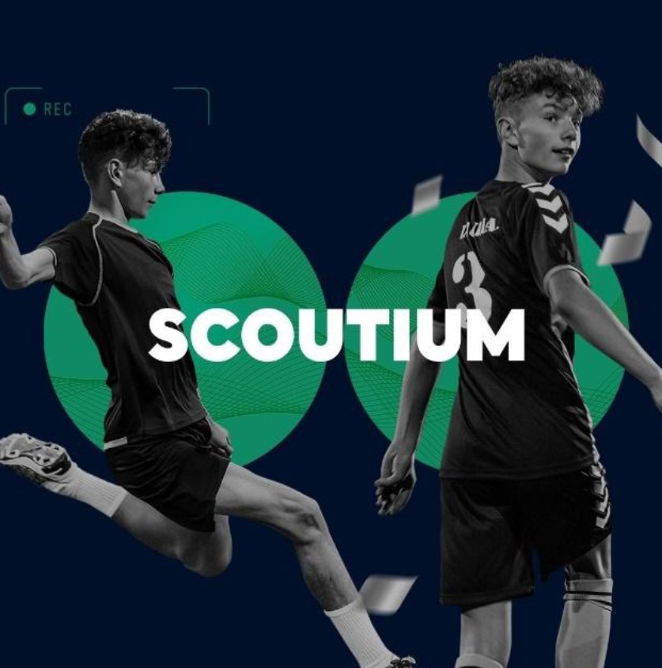

# Talent Hunting Classification with Machine Learning

## Business Problem

Predicting which class (average, highlighted) players are based on the points given to the characteristics of the football players watched by the scouts.

## Dataset

The data set consists of information containing the characteristics and scores of the football players evaluated by the scouts according to the characteristics of the football players observed in the matches from Scoutium.

scoutium_attributes.csv
|------------------|-------------------------------------------------------------------------------|
| task_response_id | The set of a scout's evaluations of all players on a team's roster in a match |
| match_id         | ID of the relevant match                                                      |
| evaluator_id     | Evaluator's (scout's) id                                                      |
| player_id        | ID of the relevant player                                                     |
| position_id      | ID of the position played by the relevant player in that match                |
| analysis_id      | Set of a scout's evaluations of a player's characteristics in a match         |
| attribute_id     | ID of each attribute on which players are evaluated                           |
| attribute_value  | The value (point) a scout gives to a characteristic of a player               |

* position_id:

1: Goalkeeper
2: Center Back
3: Right-back
4: Left back
5: Defensive midfielder
6: Central midfield
7: Right wing
8: Left wing
9: Offensive midfielder
10: Striker

scoutium_potential_labels.csv
|------------------|--------------------------------------------------------------------------------------------|
| task_response_id | The set of a scout's evaluations of all players on a team's roster in a match              |
| match_id         | ID of the relevant match                                                                   |
| evaluator_id     | Evaluator's (scout's) id                                                                   |
| player_id        | ID of the relevant player                                                                  |
| potential_label  | A tag indicating a scout's final decision regarding a player in a match. (target variable) |

    

